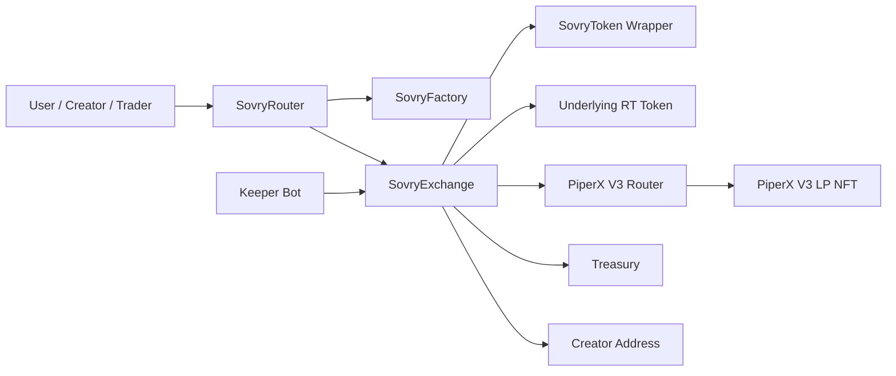
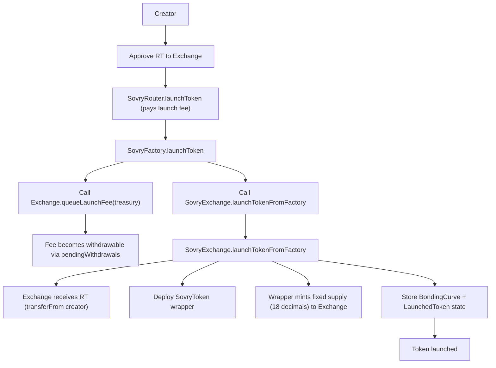
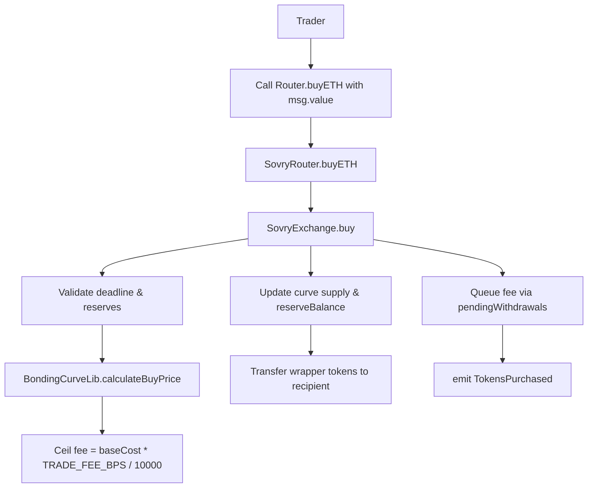
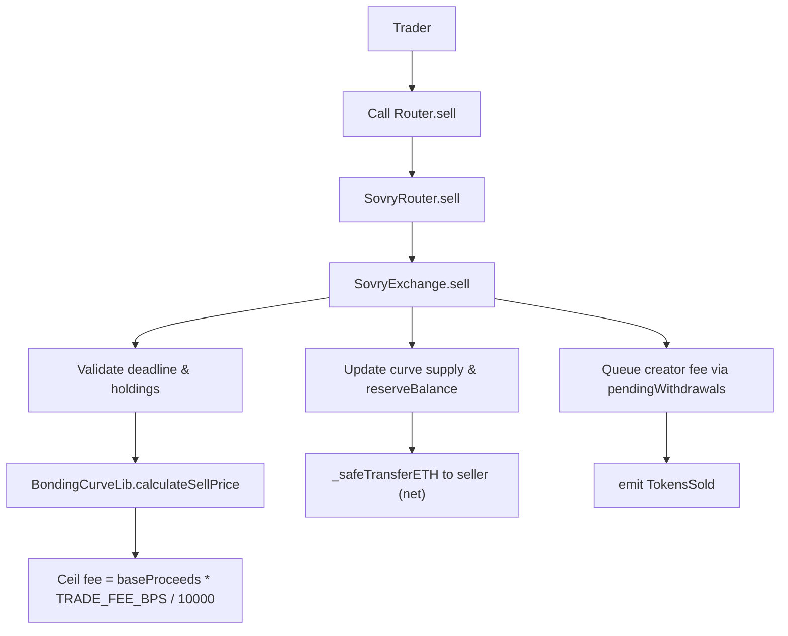
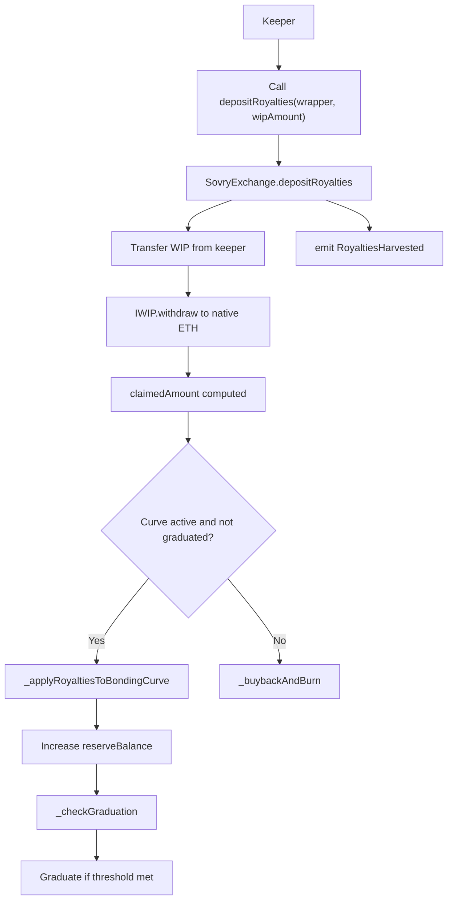
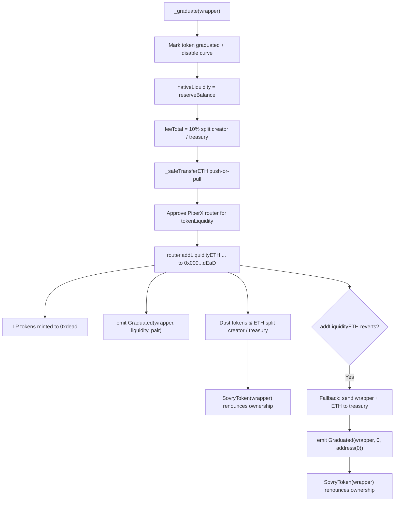
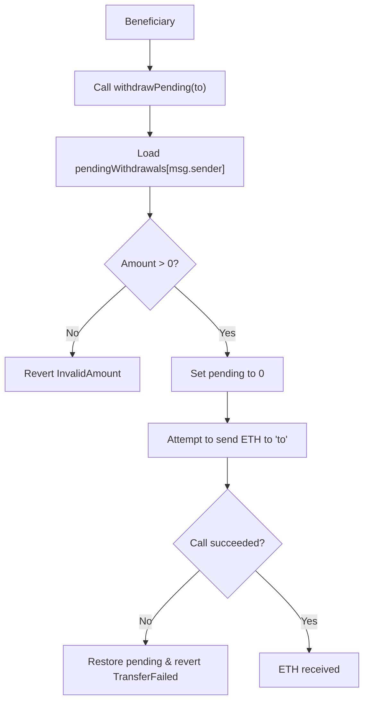
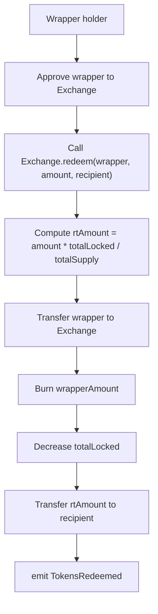

# Sovry Contracts Flow (Updated for PiperX V3, 50/50 fees)

This document describes how Sovry Launchpad works on Story Protocol (Aeneid) after the V3 upgrade. It covers Factory → Exchange → Router interactions, bonding curve trading, WIP-based royalties, graduation to PiperX **V3** with LP NFT custody, and the 50/50 treasury/IP fee split across all fees.

## High-level flow

1) **Launch** via `SovryFactory.launchToken`
   - Collects a fixed launch fee (1 ETH) and forwards to treasury via `queueLaunchFee`
   - Calls `SovryExchange.launchTokenFromFactory`
   - Deploys a new `SovryToken` wrapper (18 decimals) around 100 locked RT; wrapper transfers are locked until graduation

2) **Trade** on the bonding curve via `SovryRouter.buyETH` / `SovryRouter.sell`
   - Linear price: `basePrice + n * priceIncrement`
   - **Trade fee = 1%** of base cost, split **50% treasury / 50% IP Asset** (emitted per trade)

3) **Harvest royalties (WIP) and DEX fees (V3 LP)**
   - Royalties are ERC20/WIP (Story whitelisted); trade fees are native IP/ETH
   - Keeper calls (requires `KEEPER_ROLE`):
     - `distributeRoyalties(wrapper, wipAmount, amountOutMin)` → splits WIP **50% treasury / 50% IP Asset**
     - `harvestDexFees(wrapper, 0)` → collects PiperX V3 LP fees and splits **50% treasury / 50% IP Asset** in the collected token(s)

4) **Graduation to PiperX V3** (when threshold reached)
   - Exchange mints V3 liquidity via PositionManager; receives LP NFT (tokenId) and stores it (`lpTokenIds(wrapper)`) while keeping custody
   - Skims **10%** of native reserve pre-LP; split **50% treasury / 50% IP Asset**
   - Marks wrapper graduated, unlocks transfers, renounces wrapper ownership, and emits `Graduated(wrapper, liquidity, poolAddress)`
   - **Fallback:** if LP mint fails, intended liquidity is sent to treasury and `Graduated` emits with `poolAddress = 0`

5) **Redeem** (wrapper → RT) remains available post-graduation

## Contracts and roles

- **SovryFactory**: collects launch fee; only admin can set fee
- **SovryExchange**: holds RT reserves, manages curve, graduation, PiperX V3 LP mint + custody (LP NFT), royalties/DEX fee split 50/50 treasury/IP Asset
- **SovryRouter**: user-friendly gateway for launch / buy / sell / price view
- **SovryToken**: soulbound until graduation; 18 decimals wrapper around locked RT
- **Keeper**: `KEEPER_ROLE` allowed to harvest royalties (WIP) and collect DEX fees from V3 LP

## Events tracked by the subgraph

- `TokenLaunched`
- `TokensPurchased`
- `TokensSold`
- `TokensRedeemed`
- `RoyaltiesHarvested`
- `Graduated` (pool + LP tokenId queryable via `lpTokenIds(wrapper)`)
- `GraduationThresholdUpdated`

## Fee flows (updated)

- **Trade fee (1%)**: 50% treasury / 50% IP Asset (native IP/ETH)
- **Royalties (WIP/ERC20)**: keeper deposits WIP and splits 50/50 treasury/IP Asset (no buyback/burn)
- **DEX fees (V3 LP)**: keeper collects and splits 50/50 treasury/IP Asset in whatever token PiperX returns (wrapper/WIP ordering handled internally)
- **Graduation skim (10% native)**: 50/50 treasury/IP Asset

## Graduation path (V3)

- Uses PiperX V3 PositionManager to mint LP and receive an LP NFT (custodied by Exchange)
- If mint fails, liquidity goes to treasury; wrapper still marked graduated (fallback path)

## Redemption

- `redeem(wrapper, wrapperAmount, recipient)` burns wrapper and returns pro-rata RT

## Known differences vs old spec

- Trade fee is 1% (not 0.2%) and split 50/50 treasury/IP Asset
- Royalties are WIP/ERC20-only (per Story whitelisted tokens), no native buyback/burn
- Graduation uses PiperX V3 with LP NFT custody (not V2 burn-to-zero)

## 1. High-Level Architecture

## 2. Launch Flow

## 3. Buy Flow (Trader purchases wrapper with ETH)

## 4. Sell Flow (Trader sells wrapper for ETH)

## 5. Royalty Deposit Flow (Keeper-driven per wrapper)

## 6. Graduation Flow (PiperX V2 addLiquidity + burn LP)

## 7. Pending Withdrawal Flow (pull-based ETH claims)

## 8. Redeem Flow (Burn wrapper for pro-rata RT)

