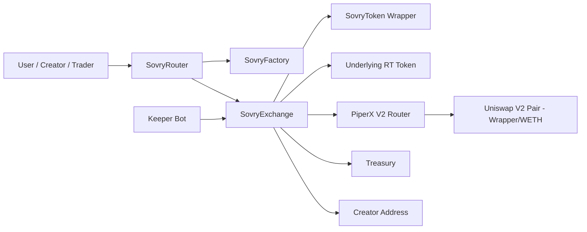
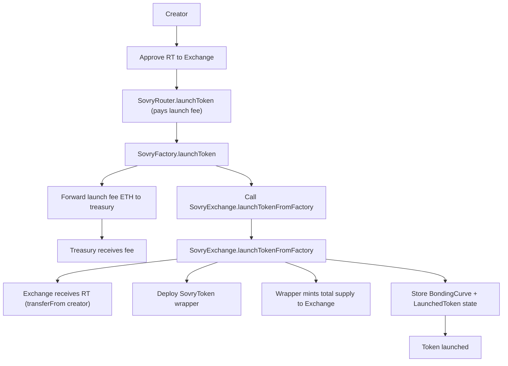
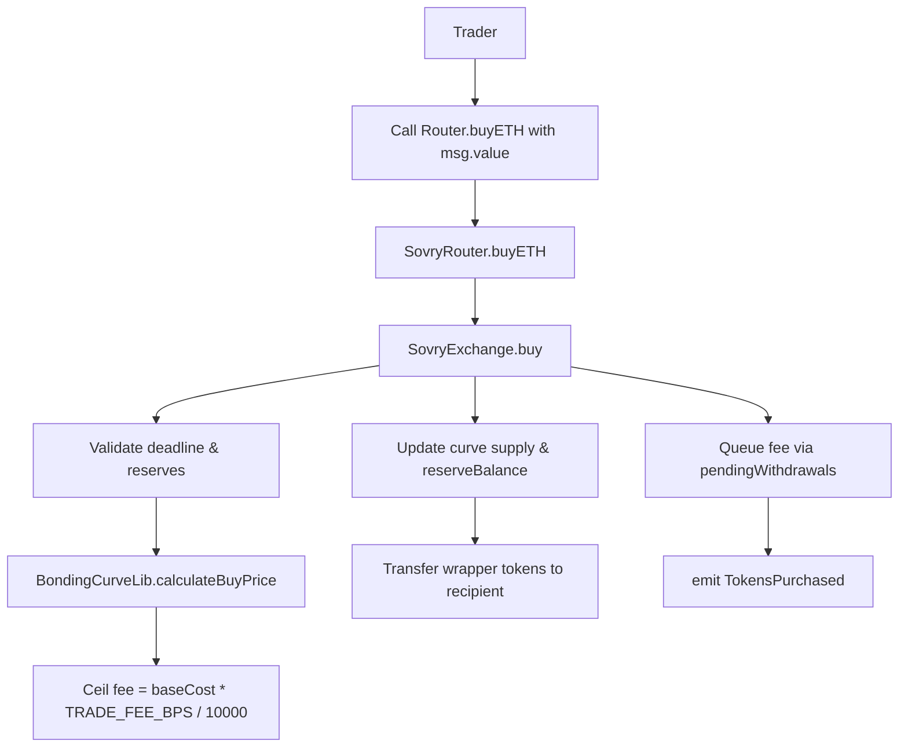
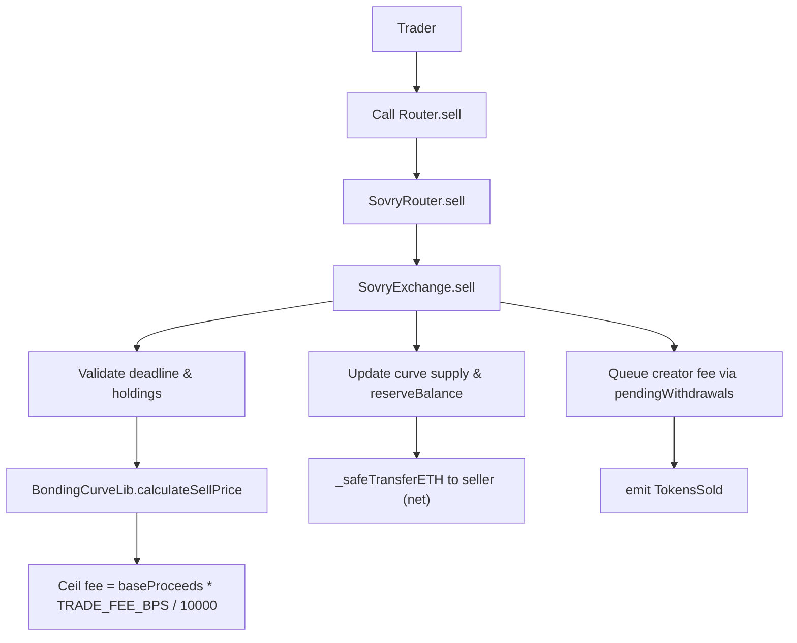
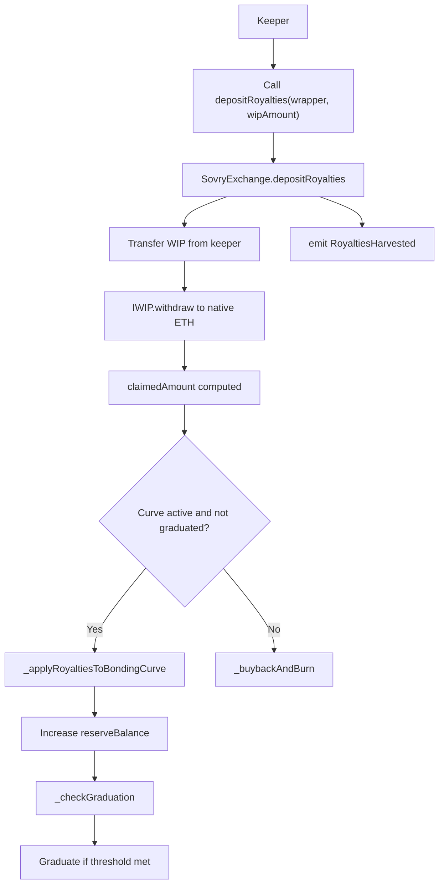
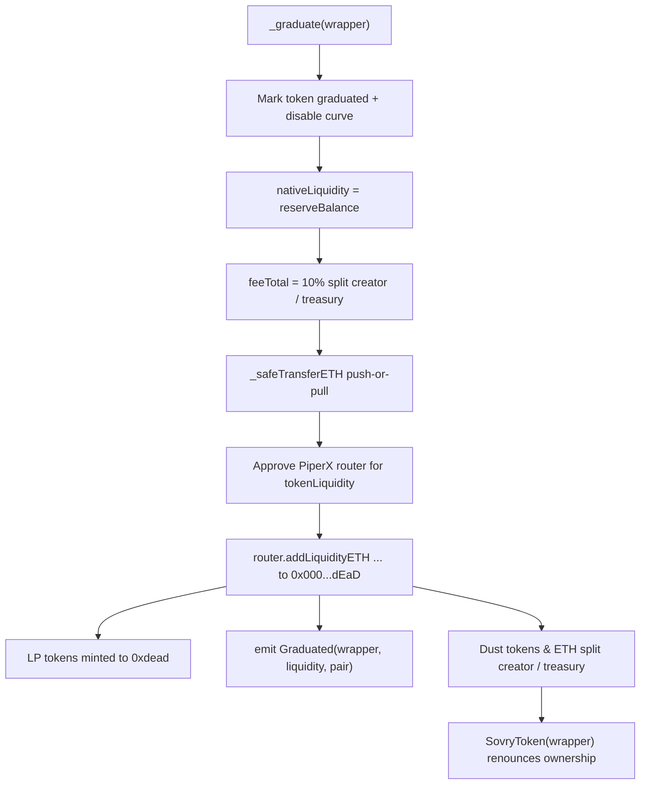
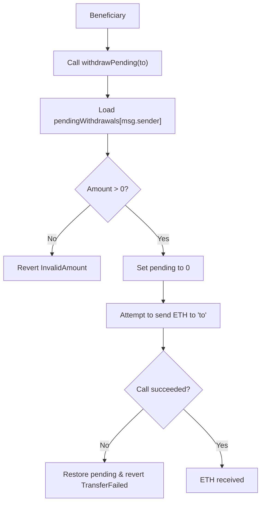

# Sovry Contracts Flow Diagrams

This document captures the current Factory ⇄ Exchange ⇄ Router architecture, including royalty handling, graduation, and pending withdrawal flows. All diagrams use Mermaid syntax and follow the latest on-chain behavior.

## 1. High-Level Architecture

## 2. Launch Flow

## 3. Buy Flow (Trader purchases wrapper with ETH)

## 4. Sell Flow (Trader sells wrapper for ETH)

## 5. Royalty Deposit Flow (Keeper-driven per wrapper)

## 6. Graduation Flow (PiperX V2 addLiquidity + burn LP)

## 7. Pending Withdrawal Flow (pull-based ETH claims)

